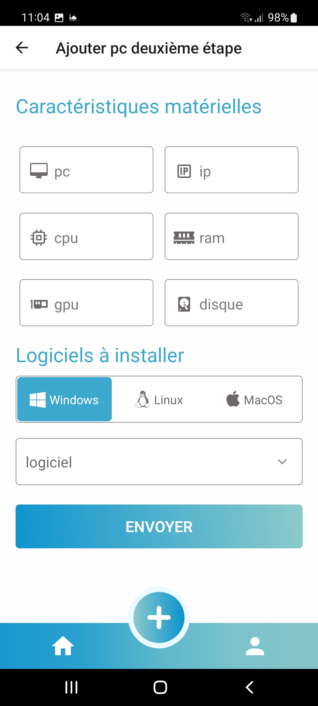
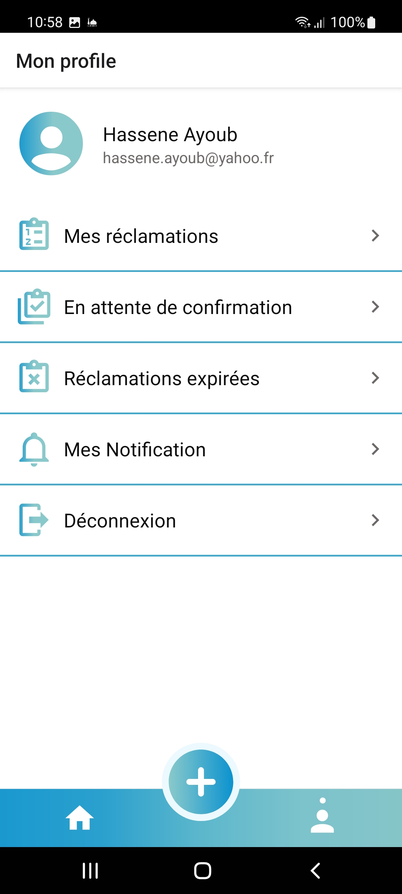

# IsammLabs
<h1 align="center">
   
  </a>
  <h4 align="center">A minimal University's labs management system made with <a href="https://reactnative.dev/" target="_blank">React Native</a>.</h4>
   
</h1>

  <a href="#key-features">Key Features</a> •
  <a href="#how-to-use">How To Use</a> •
  <a href="#download">Download</a> •
  <a href="#credits">Credits</a> •
  <a href="#related">Related</a> •
  <a href="#license">License</a>

## 💻 Technology

  
      
    
    
    

# Project screenshots

| | | |
|:-------------------------:|:-------------------------:|:-------------------------:|
| |  ||
|  |  ||
|  |  ||
